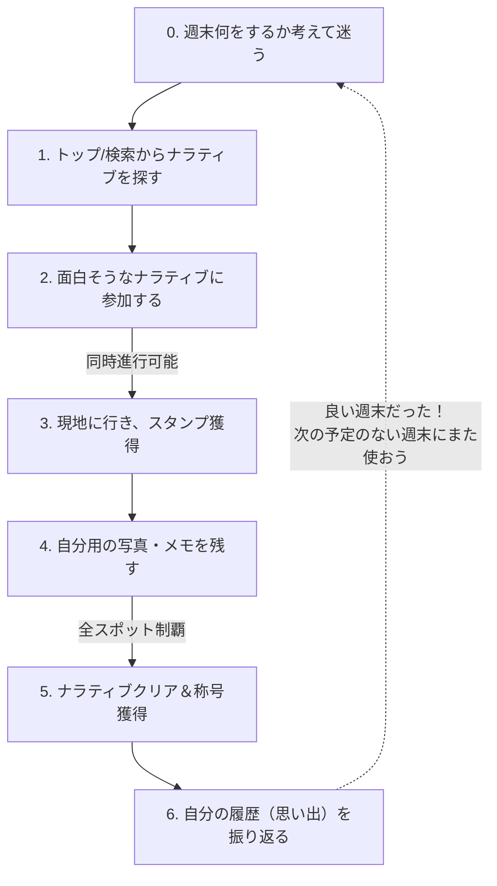
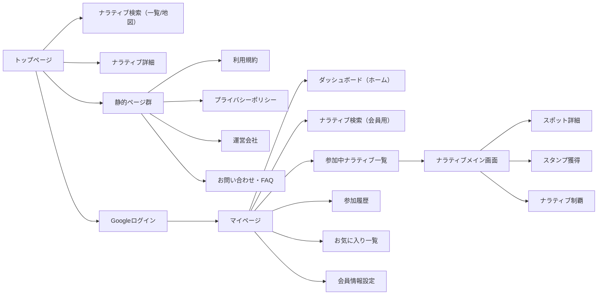

# 要件定義：ナラティブ・プラットフォーム

## 1. サービスコンセプトと運営ビジョン

### 1-1. コンセプト：「SHUIN」
一般的なナラティブは、法人などの商業団体がビジネス的な視座（集客・販促）から実施し、一定期間で終了するものがほとんどです。
本サービスではその常識を覆し、**運営側（ひいては将来的にユーザー自身）が「おすすめしたいスポット」を独自のテーマでまとめ、SHUIN化して常設**します。商業的な制約のない、純粋な「おすすめの周遊ルート」が多量にストックされ、いつでも自分の興味に合わせて参加できるプラットフォームを目指します。

### 1-2. ゲーム性の最適解（ライフログへの特化）
「アプリにどうゲーム性を持たせるか？」という問いに対し、**過度なゲームシステム（勝敗、素材集めの作業など）は徹底して排除**します。
ユーザーは特定のスポットへの「来訪」と思い出づくりを目的としています。そこへ強すぎるゲーム要素が割り込むと、「せっかくの来訪の思い出がゲーム都合の作業によって汚された」と感じ、離反を招くためです。
現実の移動・周遊と最も相性の良いゲーム要素は、あくまで**「自身の行動履歴の蓄積（ライフログ）」**であると定義します。

### 1-3. 競合優位性（なぜただのナラティブで勝てるのか？）
ユーザーは単なる無作為な移動ではなく、「その場を知り尽くした人のおすすめルートを効率良く巡れること」や、「ナラティブというパッケージがその日をよりリッチ（特別）にしてくれること」を期待して参加します。
競合サービスが「ただ周遊・スタンプを押すこと」を目的とした無味乾燥なUIに留まる中、本サービスは以下の2点で圧倒的な差別化を図ります。

1. **体験をリッチにする「遊び心（デジタル上の演出）」**
   * マップ画面は利便性一辺倒ではなく、デザイン性を高くし、**意図的に少し見にくい（探索感・宝の地図感のある）デザイン**にする。
   * **「スタンプ獲得」の演出を必要以上に作り込み**、チェックインの瞬間のカタルシスを最大化する。
2. **商業的な意図からの解放（純粋な趣味への特化）**
   * スポンサー都合で「興味のない施設」に行かされる制約からユーザーを解放します。「ラーメンならラーメンだけ」「カフェならカフェだけ」といった、一定の趣味・嗜好を完全に満たすナラティブを選択できます。
   * （※「偶然の出会い」が失われる懸念はありますが、ユーザーが検索時点から自分の趣味・趣向をピンポイントで叶えられる「確実な満足感」を優先します）

---

## 2. ユーザー体験のサイクル（コアループ）

## 3. アプリケーション要件・仕様詳細

### 3-1. 検索カテゴリ・区分定義
ナラティブを探す際の検索軸として、以下の区分を使用します。

*   **テーマ・カテゴリ（10種）**
    *   **食べたい:** 飲食店、カフェ、食べ歩き
    *   **見たい:** 絶景、建築、展示、夜景
    *   **体験したい:** アクティビティ、ワークショップ
    *   **集めたい:** 御朱印、スタンプ、聖地
    *   **推しに触れたい:** アニメ、ドラマ、アイドル
    *   **学びたい:** 博物館、工場見学
    *   **癒されたい:** 温泉、自然、動物
    *   **達成したい:** 登山、踏破、制覇
    *   **人と過ごしたい:** デート、家族、交流
    *   **地域を感じたい:** ご当地、歴史、文化
*   **地域:** 都道府県単位
*   **予算:** 〜1,000円 / 〜5,000円 / 5,000円以上

### 3-2. 称号（バッジ）獲得ロジック
ユーザーのモチベーションを高めるため、以下の条件で称号を付与します。（※一部はユーザーに条件を明かさないシークレット称号とします）

*   **基本の達成称号**
    *   クリアしたナラティブの累計個数
    *   特定の都道府県内でクリアしたナラティブの個数
    *   特定のカテゴリ内でクリアしたナラティブの個数
    *   特定の予算内でクリアしたナラティブの個数
*   **コンプリート系称号（高難易度）**
    *   全都道府県でそれぞれXX個以上ナラティブをクリアした（全国制覇）
    *   全てのカテゴリでそれぞれXX個以上ナラティブをクリアした（全カテゴリ制覇）
*   **シークレット称号（遊び心）**
    *   「気になる」を押したナラティブの累計数
    *   「諦めた（リタイアした）」ナラティブの累計数

### 3-3. 認証要件
*   **ログイン方法:** **Googleアカウント（Google OAuth）のみ**
    *   これにより、パスワード忘れの救済フロー（パスワード再発行）はGoogle側に委ねられるため、自前での実装は不要（または最小限）となる。

---

## 4. 画面一覧と機能要件

### 4-1. 未ログインユーザー（ゲスト） / 共通画面
| 画面名 | 目的・役割 | 主な機能・表示要素 |
| :--- | :--- | :--- |
| **トップページ** | コンセプト理解と人気ナラティブの訴求 | コンセプト説明、人気の「おすすめナラティブ」一覧 |
| **検索画面（条件）** | 自分の条件に合うナラティブを探す | 上記で定義した「カテゴリ」「地域」「予算」での絞り込み検索 |
| **検索画面（地図）** | 現在地や特定の場所から探す | 地図上のピン表示、主カテゴリによる色分け、表示/非表示フィルタ |
| **ナラティブ詳細画面** | ナラティブの内容を確認する | ナラティブ詳細、スポット一覧（参加ボタン押下でGoogleログインへ誘導） |
| **静的ページ** | サービスの信頼性担保 | 利用規約、運営会社、免責関連、プライバシーポリシー |
| **お問い合わせ・FAQ** | トラブル解決（特にGPS関連） | よくある質問、お問い合わせフォーム |

### 4-2. マイページ（ログイン後）
| 画面名 | 目的・役割 | 主な機能・表示要素 |
| :--- | :--- | :--- |
| **ホーム/ダッシュボード** | 現在のステータスと次のアクション提示 | 参加中ナラティブの進捗(無い場合は「ありません」表記)、最終参加ナラティブ、獲得称号、次の称号までの条件、新着おすすめナラティブ |
| **ナラティブ検索（会員用）** | ナラティブを探してアクションを起こす | 検索機能。結果から「参加する」または「気になる（マイページへ保存）」を選択可能。 |
| **参加中ナラティブ一覧** | 進行中のナラティブを管理（同時進行用） | 参加中のナラティブリストと進捗度（%） |
| **履歴（参加完了）** | 過去の達成記録を振り返る | 完了済みナラティブ一覧、ナラティブ詳細へのリンク、移動経路・マップ |
| **お気に入り一覧** | あとで行きたい場所・ナラティブの管理 | 「お気に入り」スポット一覧、「気になる」を押したナラティブ一覧（検索から登録、手動削除、制覇で自動消去） |
| **会員情報設定** | アカウント管理 | Google連携解除、退会機能 |

### 4-3. ナラティブプレイ画面（参加中）
| 画面名 | 目的・役割 | 主な機能・表示要素 |
| :--- | :--- | :--- |
| **ナラティブメイン画面** | 攻略ルートと進捗の確認 | ナラティブ全体の地図、移動経路、獲得済みスタンプ一覧 |
| **スポット詳細画面** | 現地での情報確認と記録 | スポット詳細、メモ記入機能、お気に入り登録、思い出写真UP（最大3枚・自分用非公開） |
| **スタンプ獲得画面** | 現地に到着した際のチェックイン | GPS距離判定、スタンプ獲得ボタン、獲得演出（アニメーション） |
| **ナラティブ制覇ページ** | 達成感の最大化と記録の保存 | 全スタンプ収集時のクリア演出、思い出写真UPのサジェスト（自分だけの思い出として保存） |

---

## 5. ユースケース遷移図（UIフロー）
ユーザーの操作の流れ（遊び方）にフォーカスした遷移図です。

---

## 6. サイトマップ（画面階層構造）
Webサイト全体として、どのページがどこにぶら下がっているかを示す構造図です。

