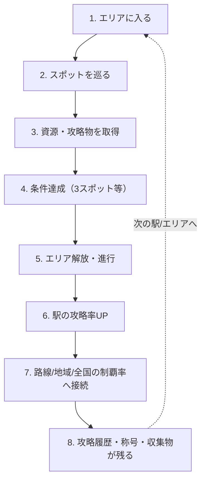
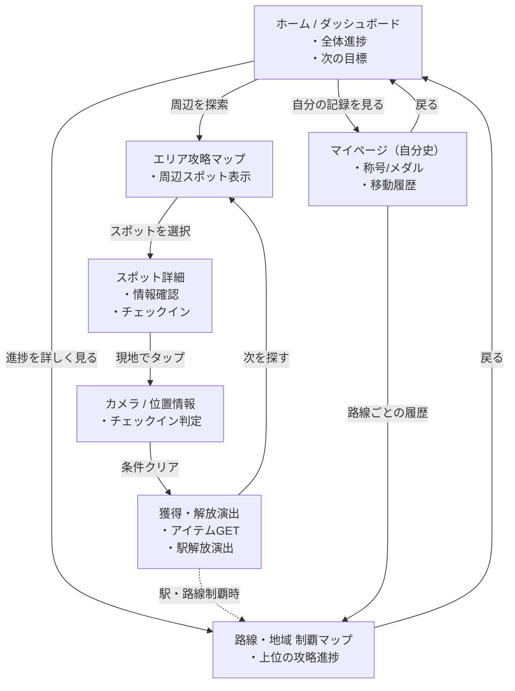

# 企画書・要件定義：移動を、制覇に変えるゲーム

## 1. サービスコンセプト
**「行った」ではなく「攻略した」に変えるゲーム。**
陣取りでも対戦でもなく、自分の攻略記録を育てていく「制覇ゲーム × 収集ゲーム × 自分史アプリ」の交点に位置する移動攻略ゲームです。

## 2. ユーザーの動機（4層構造）
プレイヤーがスポットを巡る動機は以下の4層に分類されます。

1. **主動機（制覇欲）：** 駅・路線・地域・全国を、自分の攻略履歴で埋めたい。目の前の1スポットが全国制覇に繋がる。
2. **補助動機1（収集欲）：** 路線メダルや駅ごとの攻略章など、持ちたくなる攻略物を集めたい。
3. **補助動機2（身分上昇欲）：** 「見習い探索者」「路線攻略者」など、称号やランクを上げて自分の肩書きを育てたい。
4. **補助動機3（記録欲・自分史）：** いつ、どこを、どんな順で巡り、どんな写真を残したか。現実の移動や旅を自分だけの記録として残したい。

## 3. コアループと制覇の階層

### コアループ

### 制覇の階段設計（階層構造）
* **第1層（スポット）：** 3スポット回る → 1解放する
* **第2層（駅 / エリア）：** 駅攻略率、攻略済み駅の獲得
* **第3層（路線）：** 路線攻略率、あと何駅で制覇かの可視化
* **第4層（地域 / テーマ）：** 東京制覇率、城下町踏破率など
* **第5層（全国履歴）：** 累計攻略数、全国踏破率、自分の移動年表

## 4. プロダクトフェーズ

### 初期MVPコンセプト
**「1駅を15分で攻略できる、ソロ起点の制覇ゲーム」**
まずは「駅1つを攻略し、それが路線制覇に接続する」という最小単位の熱狂を作ります。

* **MVP実装要件：**
    * 1駅 ＝ 1エリア（3〜5スポット）
    * 3スポット巡回で1解放
    * 駅攻略率 / 路線攻略率の可視化
    * 攻略履歴の保存
    * 初歩的な称号システム
    * 次の駅へ行きたくなる導線設計
* **MVP除外要件（スコープ外）：** ギルド、複雑なランキング、大量クーポン、車観光地の本格対応、重い世界観

### 5年後の完成形（ビジョン）
全国の駅・街・観光地・建物を巡り、自分の攻略履歴を積み上げていくプラットフォーム。
BtoCでの熱狂を基盤に、BtoB（駅周辺回遊、施設内ミッション、地域観光導線など）の導入パッケージへと接続させます。

---

# 画面一覧と遷移図（MVPベース）

## 1. 画面一覧表（MVPスコープ）

| 画面名 | 目的・役割 | 主な機能・表示要素 | 次のアクション |
| :--- | :--- | :--- | :--- |
| **ホーム / ダッシュボード** | 現在の進捗と次の目標の確認 | 全国の踏破率、直近の路線攻略率、現在の称号、次に行くべきおすすめ駅 | マップ画面へ、マイページへ |
| **エリア攻略マップ** | 現在地の駅・スポットを探索する | 現在地周辺の地図、スポットピン（未取得/取得済）、駅エリアの境界線 | スポット詳細へ、QRスキャンへ |
| **スポット詳細・チェックイン** | スポットの情報を確認し攻略する | スポット説明、現在地からの距離、「チェックイン（取得）」ボタン | マップへ戻る、資源獲得演出へ |
| **獲得・解放演出** | 達成感と報酬を提示する | 資源獲得アニメーション、3つ集まった際の「駅解放」演出、称号獲得ポップアップ | マップへ戻る、履歴へ |
| **路線・地域 制覇マップ** | 上位階層の達成度を確認する | 路線図ベースの塗りつぶしマップ、地域別の攻略パーセンテージ | ホームへ、マイページへ |
| **マイページ（自分史・収集）** | これまでの軌跡と収集物を愛でる | 自分の移動年表（履歴）、獲得したメダル・バッジ一覧、称号一覧、写真ログ | 各詳細ログへ |

## 2. 画面遷移図（UIフロー）

