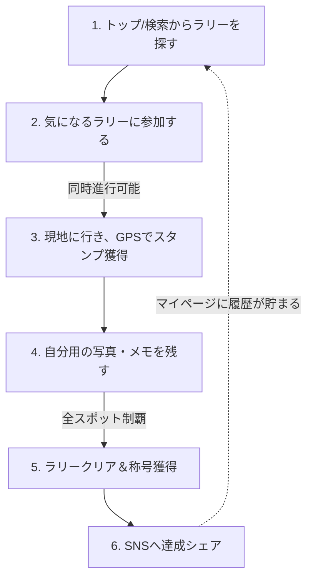

# 企画書・要件定義：スタンプラリー・プラットフォーム

## 1. サービスコンセプト
**「自分の興味に合わせて選べる、多彩なテーマのスタンプラリープラットフォーム」**
巨大な1つのゲームではなく、運営が用意した様々なテーマ（グルメ、絶景、推し活、歴史など）のスタンプラリーを選んで参加できるプラットフォームサービスです。
ユーザーは自分の好みに合ったラリーを探し、現地へ行き、自分だけの思い出（写真やメモ）を残しながら制覇を目指します。

## 2. ユーザー体験のサイクル（コアループ）



## 3. 画面一覧と機能要件

### 3-1. 未ログインユーザー（ゲスト） / 共通画面
SEOやSNS流入からの受け皿となり、会員登録へ誘導するための画面群です。

| 画面名 | 目的・役割 | 主な機能・表示要素 |
| :--- | :--- | :--- |
| **トップページ** | サービスのコンセプト理解と人気ラリーの訴求 | コンセプト説明、人気の「おすすめスタンプラリー」一覧 |
| **検索画面（条件）** | 自分の条件に合うラリーを探す | タグ検索（地域[都道府県]、カテゴリ[食べたい, 見たい, 癒されたい等]、予算） |
| **検索画面（地図）** | 現在地や特定の場所からラリーを探す | 地図上のピン表示、主カテゴリによる色分け、表示/非表示フィルタ |
| **ラリー詳細画面** | ラリーの内容を確認し、参加意欲を高める | ラリーの詳細情報、スポット一覧（参加ボタン押下で会員登録へ誘導） |
| **静的ページ** | サービスの信頼性担保 | 利用規約、運営会社、免責関連、プライバシーポリシー |
| **お問い合わせ・FAQ** | トラブル解決（特にGPS関連） | よくある質問、お問い合わせフォーム |

### 3-2. 認証・アカウント設定
| 画面名 | 目的・役割 | 主な機能・表示要素 |
| :--- | :--- | :--- |
| **会員登録 / ログイン** | アカウント作成と再ログイン | メールアドレス/SNS連携での登録・ログイン |
| **会員情報設定** | アカウント情報の管理 | パスワード変更、アドレス変更、パスワード再発行（救済）、退会機能 |

### 3-3. マイページ（ログイン後ダッシュボード）
ユーザーの現在の進捗と、過去の栄光（履歴）を管理する画面です。

| 画面名 | 目的・役割 | 主な機能・表示要素 |
| :--- | :--- | :--- |
| **ホーム/ダッシュボード** | 現在のステータスと次のアクション提示 | 参加中ラリーの進捗、最終参加ラリー、獲得称号、次の称号までの条件、新着おすすめ |
| **参加中ラリー一覧** | 進行中のラリーを管理（同時進行用） | 参加中のラリーリストと進捗度（%） |
| **履歴（参加完了）** | 過去の達成記録を振り返る | 完了済みラリー一覧、ラリー詳細へのリンク、移動経路・マップ |
| **お気に入り一覧** | あとで行きたい場所・ラリーの管理 | 「お気に入り」スポット一覧、「気になる」ラリー一覧（手動削除、制覇で自動消去） |
| **ラリーを探す** | 新しいラリーを見つける | （未ログインの検索画面と基本は同じ） |

### 3-4. ラリープレイ画面（参加中）
実際に現地で操作する、体験のコアとなる画面群です。

| 画面名 | 目的・役割 | 主な機能・表示要素 |
| :--- | :--- | :--- |
| **ラリーメイン画面** | 攻略ルートと進捗の確認 | ラリー全体の地図、移動経路、獲得済みスタンプ一覧 |
| **スポット詳細画面** | 現地での情報確認と記録 | スポット詳細、メモ記入機能、お気に入り登録、**思い出写真UP（最大3枚・自分用非公開）** |
| **スタンプ獲得画面** | 現地に到着した際のチェックイン | GPS距離判定、スタンプ獲得ボタン、獲得演出（アニメーション） |
| **ラリー制覇ページ** | 達成感の最大化 | 全スタンプ収集時のクリア演出、SNSシェアボタン、思い出写真のUPサジェスト |

---

## 4. 画面遷移図（UIフロー）

```mermaid
flowchart TD
    %% 画面ノード
    Top[トップページ\n(コンセプト/おすすめ)]
    Search[ラリー検索\n(タグ/マップ)]
    RallyDetailGuest[ラリー詳細\n(未ログイン)]
    Auth[会員登録/ログイン]
    
    MyDash[マイページ: ダッシュボード\n(進捗/称号)]
    MyFav[マイページ: お気に入り\n(スポット/気になるラリー)]
    MyHistory[マイページ: 参加履歴]
    
    RallyMain[参加中ラリー: メイン\n(マップ/進捗)]
    SpotDetail[スポット詳細\n(メモ/写真UP)]
    CheckIn[スタンプ獲得\n(GPS判定/演出)]
    Clear[ラリー制覇ページ\n(クリア演出/SNSシェア)]

    %% ゲスト遷移
    Top --> Search
    Search --> RallyDetailGuest
    RallyDetailGuest -->|参加する| Auth
    
    %% 会員遷移
    Auth --> MyDash
    MyDash --> Search
    Search -->|気になる登録| MyFav
    Search -->|参加する| RallyMain
    
    %% プレイサイクル
    MyDash -->|進行中ラリー選択| RallyMain
    RallyMain -->|スポット選択| SpotDetail
    SpotDetail -->|現地到着| CheckIn
    CheckIn -->|未コンプリート| RallyMain
    CheckIn -->|全スタンプ完了| Clear
    
    %% クリア後
    Clear -->|履歴に保存| MyHistory
    MyDash --> MyHistory
```
