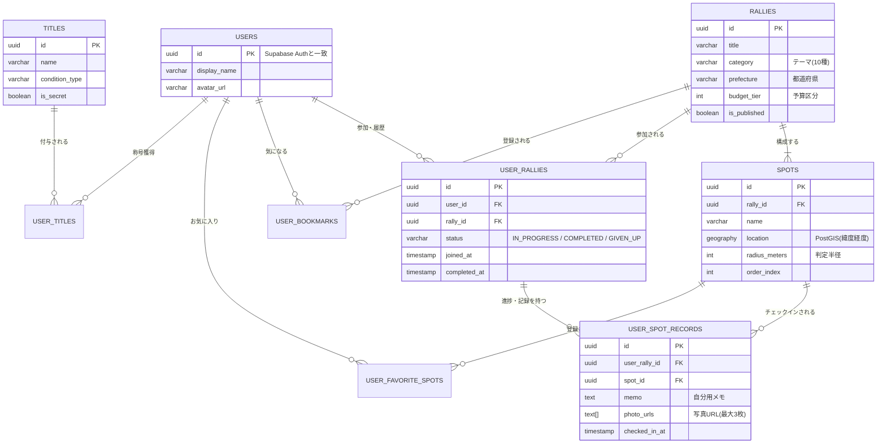

# データベース設計書（Supabase / PostgreSQL）

本プロジェクトはフロントエンドにNext.js、バックエンドに**Supabase（PostgreSQL）**を利用する前提に基づいた、RDB（リレーショナルデータベース）のスキーマ設計です。

## 全体アーキテクチャ方針
* **PostGISの活用**: `spots` テーブルにPostgreSQLの空間データ拡張機能（PostGIS）を利用し、緯度経度（Geography型）を保存します。これにより「現在地から半径Xkm以内のナラティブ検索」などがSQL一発で高速に行えます。
* **正規化とJOINの活用**: NoSQL設計時に発生していた「カウンターの自前管理」を廃止し、クリア数や称号判定に必要なデータは、必要な時にテーブルを結合（JOIN）して集計する堅牢なRDB設計にしています。

---

## 1. ER図（Entity Relationship Diagram）



---

## 2. テーブル定義詳細

### 2-1. `users`（ユーザー情報）
Supabase Auth（認証基盤）の `auth.users` に紐づく公開プロフィール用テーブルです。
* **id** (uuid, PK): `auth.users.id` への外部キー
* **display_name** (varchar)
* **avatar_url** (varchar)
* **created_at** / **updated_at** (timestamptz)

### 2-2. `rallies`（ナラティブマスタ）
運営が作成するナラティブの箱です。
* **id** (uuid, PK)
* **title** (varchar): タイトル
* **description** (text): コンセプト・説明文
* **thumbnail_url** (varchar): サムネイル画像
* **category** (varchar): テーマ（"食べたい", "見たい" 等）
* **prefecture** (varchar): 地域（"東京都" 等）
* **budget_tier** (int): 予算（1: ~1000円, 2: ~5000円, 3: 5000円以上）
* **is_published** (boolean): 公開フラグ
* **created_at** / **updated_at** (timestamptz)

### 2-3. `spots`（スポットマスタ）
ナラティブに紐づく具体的な行き先（GPSピン）です。
* **id** (uuid, PK)
* **rally_id** (uuid, FK): `rallies` テーブルへの外部キー
* **name** (varchar): スポット名
* **description** (text): スポットの解説文
* **image_url** (varchar): 参考画像
* **address** (varchar): 住所
* **location** (geography(Point, 4326)): PostGISを利用した空間データ（緯度・経度）
* **radius_meters** (int): チェックイン判定半径（デフォルト 50 等）
* **order_index** (int): 推奨ルートがある場合の並び順

### 2-4. `user_rallies`（ナラティブ参加状況・履歴トランザクション）
ユーザーのナラティブに対する状態を管理します。
* **id** (uuid, PK)
* **user_id** (uuid, FK)
* **rally_id** (uuid, FK)
* **status** (varchar): `"IN_PROGRESS"`, `"COMPLETED"`, `"GIVEN_UP"` のいずれか
* **joined_at** (timestamptz): 参加日時
* **completed_at** (timestamptz): 制覇日時
* **updated_at** (timestamptz): 最終アクション日時
* *制約*: `user_id` と `rally_id` でユニーク（同一ナラティブの複数回参加を許可する場合は不要）

### 2-5. `user_spot_records`（チェックインと思い出の記録）
各スポットでのスタンプ獲得履歴と、ユーザーのライフログ（メモ・写真）です。
* **id** (uuid, PK)
* **user_rally_id** (uuid, FK): `user_rallies` テーブルへの外部キー
* **spot_id** (uuid, FK): `spots` テーブルへの外部キー
* **memo** (text): 自分用メモ
* **photo_urls** (text[]): アップロードした写真URLの配列（PostgreSQLのArray型を利用）
* **checked_in_at** (timestamptz): 獲得日時
* *制約*: `user_rally_id` と `spot_id` でユニーク

### 2-6. ユーザーのお気に入り関連（中間テーブル）
* **`user_bookmarks`**: 「気になる」を押したナラティブ。(`user_id`, `rally_id`, `created_at`)
* **`user_favorite_spots`**: お気に入りスポット。(`user_id`, `spot_id`, `created_at`)

### 2-7. 称号関連
* **`titles`**: 称号マスタ。条件(`condition_type`, `condition_target`)とシークレット判定(`is_secret`)を持つ。
* **`user_titles`**: ユーザーが獲得した称号の中間テーブル。(`user_id`, `title_id`, `acquired_at`)

---

## 3. RDBによるデータアクセスのメリット（SQL例）

**① 現在地から5km以内のナラティブを探す（PostGISの真骨頂）**
```sql
SELECT DISTINCT r.* 
FROM rallies r
JOIN spots s ON r.id = s.rally_id
WHERE ST_DWithin(s.location, ST_SetSRID(ST_MakePoint(経度, 緯度), 4326), 5000)
AND r.is_published = true;
```

**② 「特定のカテゴリ（食べたい）」のクリア数を集計する（称号判定）**
```sql
SELECT COUNT(*) 
FROM user_rallies ur
JOIN rallies r ON ur.rally_id = r.id
WHERE ur.user_id = '指定のユーザーID'
  AND ur.status = 'COMPLETED'
  AND r.category = '食べたい';
```
